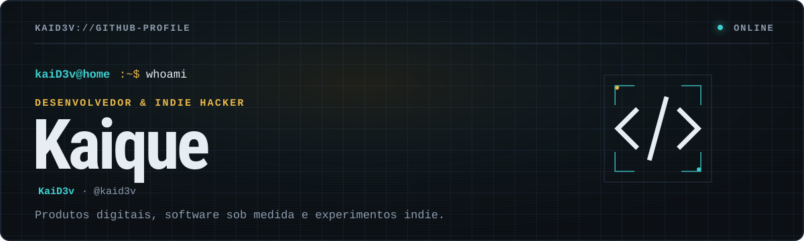

<div align="center">
  <a href="https://kaidev.com.br">
    
  </a>
</div>

<br />

<div align="center">
  <a href="https://kaidev.com.br"></a>
  <a href="https://www.linkedin.com/in/kaidev1/"></a>
  <a href="mailto:kaikricardo99@gmail.com"></a>
  <a href="https://youtube.com/@kaid3v"></a>
</div>

```console
kaiD3v@home:~$ whoami
Desenvolvedor full stack e indie hacker transformando ideias de negócio em produtos digitais.

kaiD3v@home:~$ status --now
● construindo software na N2
● lançando experimentos indie em público
● disponível para projetos e boas conversas
```

## `01 / trabalho`

Crio aplicações web de ponta a ponta — da experiência de uso à arquitetura e ao deploy. Meu foco é combinar **produto, engenharia e execução** para tirar boas ideias do papel sem complicação desnecessária.

Na **[N2](https://n2-codeworks.vercel.app/)**, transformo necessidades de negócio em software. No meu laboratório indie, valido ideias construindo produtos reais, colocando no ar e aprendendo com o uso.

## `02 / produtos`

<table>
  <tr>
    <td width="50%" valign="top">
      <sub>01 · ONLINE</sub>
      <h3>MyRemynd</h3>
      <p>Flashcards gerados por IA com revisão por repetição espaçada — para estudar de forma mais inteligente.</p>
      <p><code>Next.js</code> <code>Node.js</code> <code>Express</code> <code>TypeScript</code> <code>Radix UI</code></p>
      <a href="https://myremynd.com">visitar ↗</a> · <a href="https://github.com/KaiD3v/my-remynd">repositório ↗</a>
    </td>
    <td width="50%" valign="top">
      <sub>02 · ONLINE</sub>
      <h3>AprovaLink</h3>
      <p>Aprovações de trabalhos adicionais com valor, prazo e evidências — sem exigir conta do cliente.</p>
      <p><code>React</code> <code>TypeScript</code> <code>Node.js</code></p>
      <a href="https://aprovalink.tech">visitar ↗</a>
    </td>
  </tr>
  <tr>
    <td width="50%" valign="top">
      <sub>03 · ONLINE</sub>
      <h3>PlotRipple</h3>
      <p>Consequências narrativas com IA para transformar decisões de RPG em novas cenas e ramificações.</p>
      <p><code>Next.js</code> <code>TypeScript</code> <code>Tailwind</code> <code>Gemini</code> <code>Upstash</code></p>
      <a href="https://plotripple.quest/en">visitar ↗</a> · <a href="https://github.com/KaiD3v/plotripple.quest">repositório ↗</a>
    </td>
    <td width="50%" valign="top">
      <sub>04 · DIRETÓRIO</sub>
      <h3>Mais experimentos</h3>
      <p>Projetos, protótipos e estudos que mostram como penso, construo e evoluo produtos.</p>
      <p><code>build</code> <code>ship</code> <code>learn</code> <code>repeat</code></p>
      <a href="https://kaidev.com.br">abrir portfólio →</a>
    </td>
  </tr>
</table>

## `03 / stack`

<div align="center">
  
  
  
  
  
  
  
  
  
  
  
  
</div>

<details>
  <summary><strong>ver ferramentas por área</strong></summary>
  <br />

  - **Frontend:** React, Next.js, HTML, CSS, Tailwind CSS e Vite
  - **Backend:** Node.js, Express, APIs REST e integrações com IA
  - **Dados:** PostgreSQL, MySQL, MongoDB, Redis e SQLite
  - **Infra & produto:** Docker, AWS, Google Cloud, Git, Figma e Postman
</details>

## `04 / atividade`

<div align="center">
  
  
</div>

> Estatísticas representam apenas repositórios públicos e não definem experiência ou senioridade.

## `05 / connect`

Tem uma ideia que precisa sair do papel, quer trocar sobre produto ou encontrou algo interessante por aqui?

**[Acesse meu site](https://kaidev.com.br)** · **[Conecte-se no LinkedIn](https://www.linkedin.com/in/kaidev1/)** · **[Envie um e-mail](mailto:kaikricardo99@gmail.com)**

```console
kaiD3v@home:~$ echo "build. ship. learn. repeat."
build. ship. learn. repeat.
```
